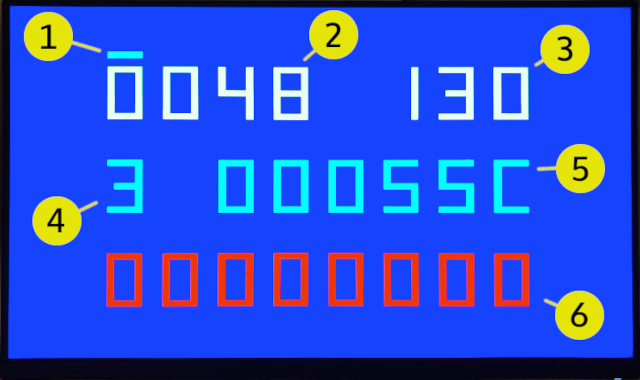

# MemTest - Utility to test SDRAM daughter board.

Memtest by Somhic ported from Neptuno https://github.com/neptuno-fpga/MemTest_Mister, which was ported from Multicore 2, which was already ported from original Memory tester for MiSTer (https://github.com/MiSTer-devel/MemTest_MiSTer).

**Now compatible with [Deca Retro Cape 2](https://github.com/somhi/DECA_retro_cape_2)** (new location for 3 pins of old SDRAM modules). Otherwise see pinout below to connect everything through GPIOs.

**Features:**

* HDMI  video output
* VGA video output is available through GPIO (see pinout below). 
  
* Added board buttons to control test without keyboard (see below)

Tested with 32 MB SDRAM board for MiSTer (extra slim) XS_2.2 ([see connections](https://github.com/SoCFPGA-learning/DECA/tree/main/Projects/sdram_mister_deca))

**Recommended additional hardware** (withouth it the core works):

- SDRAM module for testing. 
- PS/2 Keyboard connected to GPIO  (see pinout below)

**STATUS**:

- 22/04/22 compatible with Deca Retro Cape 2 (old sdram 3 pins new location)
- Working fine with new 32 MB memory modules. Stable at 160 MHz. Tested with 32 MB SDRAM board for MiSTer (extra slim) XS_2.2 ([see connections](https://github.com/SoCFPGA-learning/DECA/tree/main/Projects/sdram_mister_deca))

* Does not work with 128 MB memory modules. 

**Compiling:**

* Load project  in /synth/DECA/memtest_deca.qpf
* sof/svf files already included in /synth/DECA/output_files/

**Pinout connections:**

Mouse, Joystick and Audio/MIDI are not defined in this core.

Keyboard is optional as core can be controlled  by board buttons (see below)

## Memtest screen:

 1. Auto mode indicator (animated)
 2. Test time passed in minutes
 3. Current memory module frequency in MHz
 4. Memory module size:
    * 0 - no memory board
    * 1 - 32 MB
    * 2 - 64 MB
    * 3 - 128 MB
 5. Number of of passed test cycles (each cycle is 32 MB)
 6. Number of failed tests.

## Controls (keyboard)
* Up - increase frequency   (DECA KEY0 BUTTON)

* Down - decrease frequency (DECA KEY1 BUTTON)

* ESC - reset the test

* A - auto mode, detecting the maximum frequency for module being tested. Test starts from maximum frequency. With every error frequency will be decreased. [DECA SW1 SWITCH]
  
  

Test is passed if amount of errors is 0. For quick test let it run for 10 minutes in auto mode. If you want to be sure, let it run for 1-2 hours.

Board should pass at least 130 MHz clock test. Any higher clock will assure the higher quality of the board.